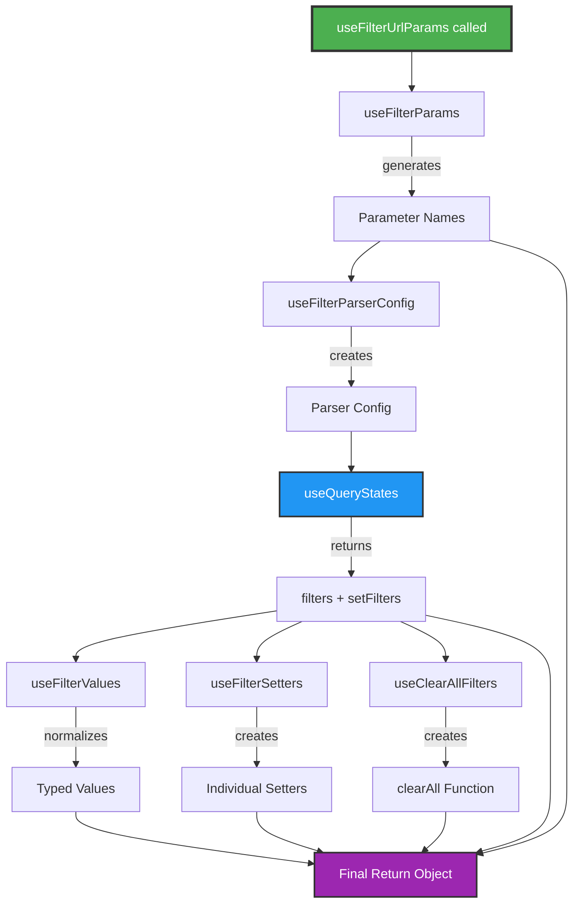

```mermaid

graph TD
    Start[useFilterUrlParams called] --> Step1[useFilterParams]
    Step1 --> |generates| ParamNames[Parameter Names]

    ParamNames --> Step2[useFilterParserConfig]
    Step2 --> |creates| Config[Parser Config]

    Config --> Step3[useQueryStates]
    Step3 --> |returns| State[filters + setFilters]

    State --> Step4[useFilterValues]
    Step4 --> |normalizes| Values[Typed Values]

    State --> Step5[useFilterSetters]
    Step5 --> |creates| Setters[Individual Setters]

    State --> Step6[useClearAllFilters]
    Step6 --> |creates| Clear[clearAll Function]

    Values --> Return[Final Return Object]
    Setters --> Return
    Clear --> Return
    ParamNames --> Return
    State --> Return

    style Start fill:#4CAF50,stroke:#333,stroke-width:3px,color:#fff
    style Step3 fill:#2196F3,stroke:#333,stroke-width:2px,color:#fff
    style Return fill:#9C27B0,stroke:#333,stroke-width:2px,color:#fff
```
